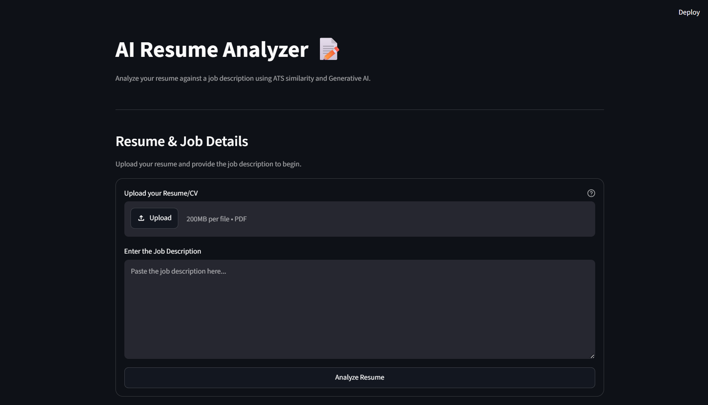
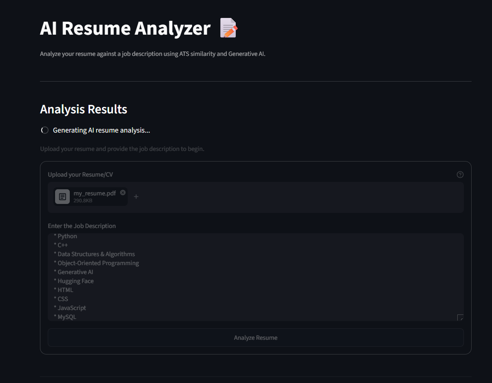
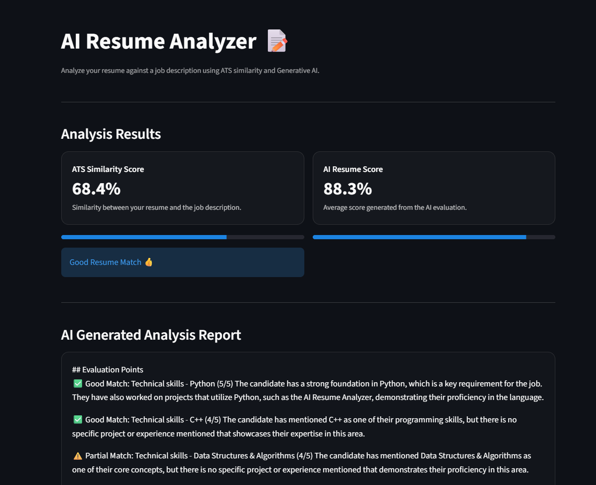

# AI Resume Analyzer

An AI-powered Resume Analyzer that compares a candidate's resume with a job description using semantic similarity and Generative AI.

## Features

- Resume PDF upload
- PDF text extraction
- ATS similarity score
- AI-based resume analysis
- Requirement-wise evaluation with scores
- Resume improvement suggestions
- The generated analysis report can be downloaded for later reference.
- Simple and responsive Streamlit interface

## Tech Stack

- Python
- Streamlit
- PDFMiner
- Sentence Transformers
- Scikit-learn
- Groq API
- python-dotenv

## Project Structure

```text
AI-Resume-Analyzer/
│
├── assets/
│   └── style.css
│
├── reports/
├── sample_resume/
│
├── utils/
│   ├── __init__.py
│   ├── ats.py
│   ├── helper.py
│   ├── llm.py
│   └── pdf_reader.py
│
├── .env.example
├── .gitignore
├── main.py
├── README.md
└── requirements.txt
```

## Setup

### 1. Clone the repository

```bash
git clone https://github.com/priyanshu-k-code/AI-Resume-Analyzer.git
cd AI-Resume-Analyzer
```

### 2. Create a virtual environment

```bash
python -m venv .venv
```

Activate it on Windows:

```powershell
.venv\Scripts\activate
```

### 3. Install dependencies

```bash
pip install -r requirements.txt
```

### 4. Configure the Groq API key

Create a `.env` file in the project root:

```env
GROQ_API_KEY=your_groq_api_key_here
```

Do not upload `.env` to GitHub.

### 5. Run the application

```bash
streamlit run main.py
```

## How It Works

1. The user uploads a resume in PDF format.
2. PDFMiner extracts the resume text.
3. Sentence Transformers generate semantic embeddings for the resume and job description.
4. Cosine similarity is used to calculate the ATS similarity score.
5. Groq generates a detailed AI evaluation of the resume.
6. Scores from the AI report are used to calculate the average AI score.
7. 7. The generated analysis report can be downloaded for later reference.


## Screenshots

### Home Page



### Resume Analysis



### Generated Report



## Notes

The ATS similarity score is a semantic similarity indicator and should not be treated as an exact replica of any particular company's ATS.

## Author

Priyanshu Kumar
